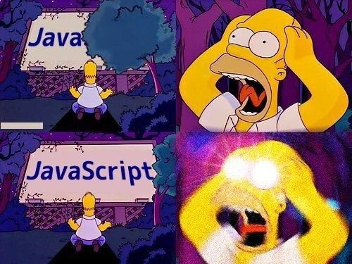

# Backend Engineering With Javascript

JavaScript in the backend refers to the use of JavaScript as a programming language for server-side development. Traditionally, JavaScript was primarily used for client-side scripting in web browsers. However, with the introduction of technologies like Node.js, JavaScript can now be executed on the server as well.

JavaScript is considered a dynamic language due to its ability to adapt and change during runtime. It allows for flexible coding practices, such as modifying objects and adding or removing properties on the fly. This dynamic nature enables developers to write code that can respond to different situations and requirements without the need for explicit type declarations or static structures.

In the backend, the dynamic nature of JavaScript allows for more efficient development processes, as it facilitates rapid prototyping and iteration. It also enables the creation of flexible and scalable server applications that can handle real-time data updates and asynchronous operations.

Overall, JavaScript's dynamism in the backend empowers developers with the flexibility and versatility needed to build dynamic and responsive server applications.
